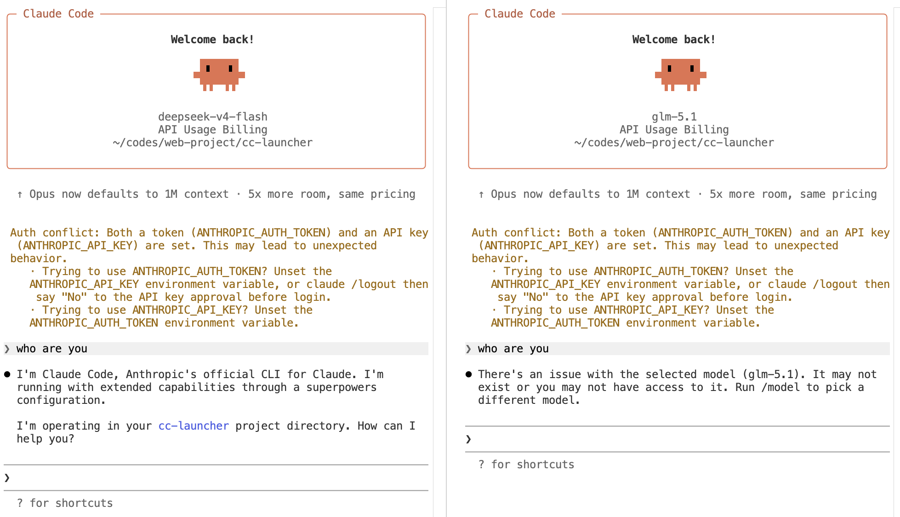

# cce - Claude Code Environment Manager



> Manage multiple Claude Code configurations and switch between different providers/models in different terminals.

## What it does

Claude Code reads `~/.claude/settings.json` for `env` overrides (API key, base URL, model), which **take precedence over process environment variables**. This makes it impossible to run different providers in different terminals.

`cce` solves this by using `--settings` to inject per-environment overrides, so you can run DeepSeek in terminal 1 and GLM in terminal 2 simultaneously — no global config changes.

## Install

```bash
npm install -g @sukeyu/cce
```

## Quick Start

```bash
# Add an environment
cce add deepseek \
  --provider deepseek \
  --model deepseek-v4-flash \
  --api-key sk-xxx \
  --api-base https://api.deepseek.com/anthropic

# Add another
cce add glm \
  --provider zhipu \
  --model glm-5.1 \
  --api-key xxx \
  --api-base https://open.bigmodel.cn/api/anthropic

# List environments
cce list

# Run Claude Code with a specific environment
cce --env deepseek

# Pass any claude arguments through
cce --env deepseek -p "say hello"
cce --env deepseek --resume
```

## Commands

| Command | Description |
|---------|-------------|
| `cce --env <name>` | Run Claude Code with the specified environment |
| `cce --env <name> <args...>` | Run with extra claude arguments |
| `cce add <name> [options]` | Add a new environment |
| `cce remove <name>` | Remove an environment |
| `cce list` | List all environments |
| `cce activate <name>` | Set default environment |
| `cce doctor` | Show current environment config |
| `cce import <file>` | Import environment from file |
| `cce export [--env <name>] <file>` | Export environment to file |
| `cce version` | Print version |

## Add Options

| Option | Description |
|--------|-------------|
| `--provider` | Provider name (e.g. deepseek, zhipu, openai) |
| `--model` | Model name (e.g. deepseek-v4-flash, glm-5.1) |
| `--api-key` | API key |
| `--api-base` | API base URL |
| `--claude-bin` | Path to claude binary |
| `--extra-env K=V` | Extra environment variables (repeatable) |

## Config Storage

```
~/.config/cce/
├── default          # Active default env name
└── envs/
    ├── deepseek.env
    └── glm.env
```

Each `.env` file:

```env
CCE_PROVIDER=deepseek
CCE_MODEL=deepseek-v4-flash
ANTHROPIC_API_KEY=sk-xxx
ANTHROPIC_BASE_URL=https://api.deepseek.com/anthropic
```

File permissions are set to `600` to protect API keys.

## How it works

`cce` launches `claude` as a child process with:

1. **Environment variables** — sets `ANTHROPIC_API_KEY`, `ANTHROPIC_BASE_URL`, etc. in the process env
2. **`--settings` override** — injects a JSON settings blob to override the `env` block from `~/.claude/settings.json` (which would otherwise take precedence)

This approach:
- Does not modify `~/.claude/settings.json`
- Does not interfere between terminals
- Your normal `claude` usage without `cce` is unaffected

## License

[MIT](LICENSE)
